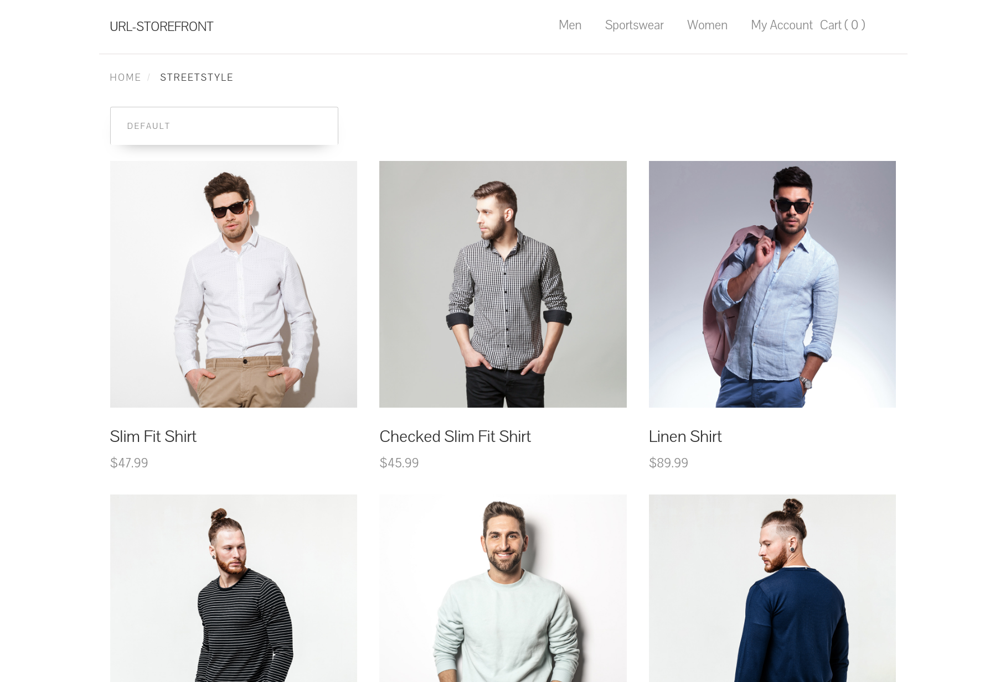
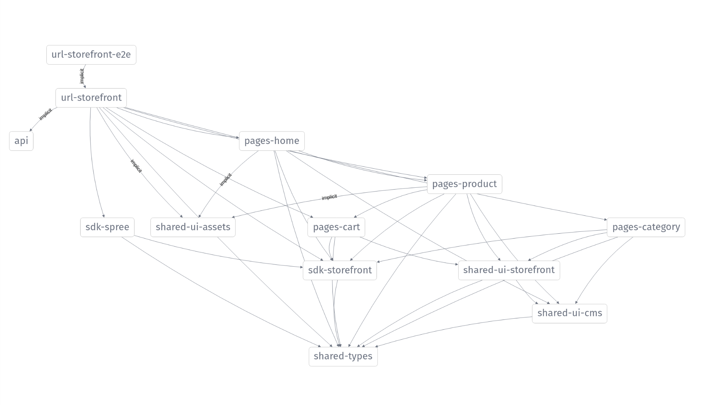

| Home        | Category    | Product |
| :---------: | :---------: | :---: |
|   |   |  |
| Home Page   | Category Page | Product Page  |

# Url Storefront

<small>*Note*: Please bear in mind that this project is in an early development phase!</small>

```Url Storefront``` is a lean, configurable and extendable ([Angular](https://angular.io/)-based) JavaScript Headless E-Commerce Storefront application.

It is designed with **extendability** in mind. Therefor the support for a *3rd Party Data Providers* (such as [Spree](https://spreecommerce.org/), ...) is built in allowing pluggability to any Ecommerce platform (provided that its offering its Data through the Consumer based APIs).

```url-storefront``` supports core storefront features such as:

- Home page
- Categories
- Product details
- Cart page
- Adding to cart
- ~~Search~~ (to be implemented)
- ~~Checkout~~ (to be implemented)
- ~~Order history~~ (to be implemented)

## 3rd Party Adapters

<small>In the near future, the support for **more 3rd Party Adapters** will be added into the project.</small>

### Spree Adapter

Currently ```url-storefront``` uses a built-in [Spree  Adapter](./libs/sdk/spree) library providing data from the 3rd Party Data Provider -> [Spree Commerce](https://spreecommerce.org/) using thier open-source [REST API](https://api.spreecommerce.org/)s by wrapping their [Spree Storefront JS/TS SDK](https://github.com/spree/spree-storefront-api-v2-js-sdk) internally.

More info could be found in ```Spree SDK library```'s [Readme](./libs/sdk/spree/README.md).

## Running the application

***Prerequisite:*** Install application dependencies by running ```yarn``` (or ```npm install```).

To run both Front-End and Back-End with one command you could execute:

- ```npm run serve-url-storefront-all``` for starting both the Back-End as well as Front-End app within one terminal.

To run the application locally execute the following commands:

- ```npm run serve:url-storefront-api``` for starting the Back-End app
- ```npm run serve:url-storefront``` for starting the Front-End app

Running the application with docker-compose is possible with:

- ```npm run serve:docker-compose:dev``` for starting both the Back-End as well as Front-End app with development profile of docker-compose. After that open [http://localhost:8001](http://localhost:8001) for interacting with the Storefront.

## Documentation

This project is using [Nx](https://nx.dev) tools (*find out more about using the tool within the project [here](./docs/Nx.md)*).

### Architecture

The application represents a **mono-repo** consiting of 2 main applications:

- [api](./apps/api/src/main.ts) - Back-End application (used for development purposes). Its main purpose is providing an [Endpoint](./apps/api/src/app/app.controller.ts) serving as a Proxy to an online Spree Demo Application (allowing usage of online demo application locally by bypassing the Cors issues).
- [url-storefront](./apps/url-storefront/src/main.ts) - Front-End Angular Headless Storefront application.

And couple of (npm publishable) libraries:

- [@url/pages/home](./libs/pages/home/src/index.ts) - ```Home``` library encapsulating home features/components
- [@url/pages/category](./libs/pages/category/src/index.ts) - ```Category``` library encapsulating category features/components
- [@url/pages/product](./libs/pages/product/src/index.ts) - ```Product``` library encapsulating product features/components
- [@url/pages/cart](./libs/pages/cart/src/index.ts) - ```Cart``` library encapsulating cart features/components
- [@url/sdk/spree](./libs/sdk/spree/src/index.ts) - library warpper arround 3rd party [Spree Commerce API](https://api.spreecommerce.org/). It encapsulates [spree-storefront-api-v2-js-sdk](https://github.com/spree/spree-storefront-api-v2-js-sdk) making it conformable to ```url-storefront``` internal pluggable specification (internal [SDK Service api/interface](libs/sdk/storefront/src/lib/services/abstract-storefront-sdk.service.ts)).
- [@url/sdk/storefront](./libs/sdk/storefront/src/index.ts) - this is **main application SDK library** (ng modulel). It exposes the main SDK Service [SdkService](./lib/sdk/../../libs/sdk/storefront/src/lib/services/sdk.service.ts) intended to be used within the application (this is a proxy service around [StorefrontSdkService](./lib/sdk/../../libs/sdk/storefront/src/lib/servicee/../services/storefront-sdk.service.ts) which is an actual internal url-storefront BackEnd service implementation, retrieving all the data from internal url-storefront BackEnd).
  - You can provide your own 3rd party storefront service, like it is done in [@url/sdk/spree library](./libs/sdk/spree/src/index.ts) in [SpreeStorefontSdkService](libs/sdk/spree/src/lib/services/spree-storefront-sdk.service.ts). To do that all you need to do is expose new ```3rdPartySdkService``` whcih conforms to internal [SDK Service api/interface](libs/sdk/storefront/src/lib/services/abstract-storefront-sdk.service.ts) and then configure the ```url-storefront``` application easily to use that ```3rdPartySdkService``` (instead of default one) by overriding base SDK Servcie provider ```providers: [{ provide: StorefrontSdkService, useClass: SpreeStorefrontSdkService }]``` (check [main app.module.ts](./apps/url-storefront/src/app/app.module.ts) for an example)
- [@url/shared/types](./libs/shared/types/src/index.ts) - this is where all internal application types/model definitions are defined
- [@url/shared/ui/cms](./libs/shared/ui/cms/src/index.ts)
- [@url/shared/ui/storefront](./libs/shared/ui/storefront/src/index.ts)

Following image shows the Application's dependency-graph:



For seeing the entire **applications architecture** and **depnendecy graph** run ```npm run dep-graph``` command and navigate to [http://127.0.0.1:4211](http://127.0.0.1:4211).

## Contribution

This project is in **early development phase**. Any feedback, ideas, requests and contributions are welcome.

If deciding to contribute, please read the [Contribution](./docs/Contribution.md)'s page to learn how to help others, report an issue or do the code contribution.

### To Do

There is an extensive list of ```things to be done``` in the project, some of which are categorized and listed as a starting reference on [Todo](./docs/Todo.md) page.

## Support

```url-storefront``` is provied ```as is``` with no official lines of support.

For any specific questions or help please reach out to [creator](mailto:uroslates@gmail.com).

## Contributors

- Design (html/css) based on [katherinekato](https://www.katherinekato.com/)'s [Product CodePen](https://codepen.io/kathykato/pen/gdvjax) solution.

## License

Copyright (c) 2021 Uros Lates.  This file is licensed under the Apache Software License, v. 2 except as noted otherwise in the [LICENSE](./docs/LICENSE.md) file.
